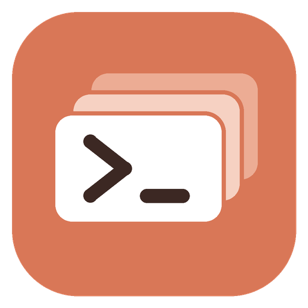

# Claude Profile Manager

A small cross-platform desktop app (Go + [Fyne](https://fyne.io)) for keeping **several Claude accounts signed in at the same time**. Each *profile* is an isolated context with its own login. You can launch **Claude Code** (CLI) or **Claude Desktop** in any profile, and run them side by side without signing out.

Windows is the main target. macOS and Linux are supported too.



## How isolation works

| | Mechanism | What moves |
|---|---|---|
| **Claude Code** | `CLAUDE_CONFIG_DIR=<profile>/claude-code` | settings, `CLAUDE.md`, agents, commands, skills, MCP config, history, projects, `.claude.json`, and on Windows/Linux the `.credentials.json` login. On macOS the OAuth token lives in the Keychain under an entry keyed by the config dir, so it is still per-profile. |
| **Claude Desktop** | Electron `--user-data-dir=<profile>/claude-desktop` | the whole app state, including the session, chats cache, settings and connectors. A separate data dir also means a separate single-instance lock, so several Desktop windows can run at once. |
| **Auth env vars** | `ANTHROPIC_API_KEY`, `ANTHROPIC_AUTH_TOKEN` and `CLAUDE_CODE_OAUTH_TOKEN` are cleared before launch | An inherited key would otherwise silently override the profile's own login. You can opt out per profile. |
| **Optional** | *Isolate HOME*: also points `HOME`/`USERPROFILE` at `<profile>/home` | For tools that ignore `CLAUDE_CONFIG_DIR`. It is off by default because it also hides your git/ssh config. |

Claude Code runs from a small generated launch script (`launch.cmd`/`launch.ps1` on Windows, `launch.command` on macOS, `launch.sh` on Linux). The script sets the environment itself, so it works even when the terminal (Windows Terminal, Terminal.app) opens the tab in an already-running process that wouldn't inherit our environment. When Claude exits, the window stays open as a shell that still has the profile's environment.

## Features

- Create, edit, duplicate and delete profiles, each with a name, description and colour.
- Shows which account each profile is signed in to. It reads `oauthAccount` from `.claude.json` and never reads your tokens.
- Launch Claude Code in the profile's default folder or in a folder you pick.
- Launch Claude Desktop per profile.
- Per-profile extra CLI args (for example `--model opus --permission-mode plan`), environment variables and working directory.
- New profiles can copy `settings.json`, `CLAUDE.md`, `agents/`, `commands/`, `skills/`, `output-styles/`, `hooks/` and `plugins/` from your existing `~/.claude`. Credentials and history are never copied.
- **Copy command** gives a PowerShell / cmd / POSIX one-liner that starts Claude Code in the profile from any terminal.
- **System tray** (on by default; *Settings → Show system tray icon*): closing the window keeps Profile Manager running. Left-click the tray icon to reopen the window; right-click it for per-profile launchers, current usage, the usage pop-out and **Quit**.
- **Usage monitoring per profile**: 5-hour session and weekly plan usage, with bars, percentages and reset times. Profile Manager reads each profile's own Claude Code login (`.credentials.json`, or the macOS Keychain entry `Claude Code-credentials-<sha256(config dir)[:8]>`) and calls the same endpoint Claude Code's `/usage` uses (`api.anthropic.com/api/oauth/usage`). Tokens are never refreshed or modified. It polls every 5 minutes by default and backs off automatically if the API rate-limits. Profiles that only use Claude Desktop (no Claude Code login) can't show usage.
- **Per-profile tray icons** (Windows): tick *Tray icon* in a profile's Usage section to get its own tray icon, drawn either as a filling bar or as a percentage number (*Settings → Profile tray icons*). The icon tracks the 5-hour session, the weekly limit or whichever is higher. The tooltip shows both. Left-click opens the profile; right-click has Claude Code / Claude Desktop / Refresh. The systray library Fyne uses supports only one icon, so on macOS and Linux usage appears in the main tray menu instead.
- **Usage pop-out**: a compact window (toolbar grid button or tray menu) with a bar and percentage per profile. Choose which profiles it lists (list button, or *In pop-out* on each profile), and tick **Pin on top** to keep it above other windows (Windows; Linux needs `wmctrl`). It reopens on start if you left it open.
- **Windows Store / MSIX installs**: Windows won't start the packaged Claude Desktop with custom arguments. *Settings → Create portable copy* copies the app out of the package once, so it can be started per profile. Refresh the copy after Claude Desktop updates.
- Command line (`cpm`) for shortcuts and scripts:

```text
cpm list                              list profiles and their accounts
cpm run <profile> [--dir D] [-- args] run Claude Code in THIS terminal
cpm open <profile> [--dir D]          open Claude Code in a new terminal window
cpm desktop <profile>                 start Claude Desktop for the profile
cpm env <profile> [--shell S]         print a start command (powershell | cmd | posix)
cpm create <name> [--copy-default]    create a profile
cpm paths                             show data folder and detected tools
```

`<profile>` can be the name, its slug (`work-account`) or the ID. The GUI binary accepts the same commands, except `run`, which needs the console build.

Tip for Windows shortcuts: set the target to `cpm.exe desktop work` or `cpm.exe open work`.

## Where data lives

| OS | Default |
|---|---|
| Windows | `%APPDATA%\ClaudeProfileManager` |
| macOS | `~/Library/Application Support/ClaudeProfileManager` |
| Linux | `~/.config/ClaudeProfileManager` |

Set `CPM_HOME` to relocate everything. Inside it you'll find `profiles.json`, `settings.json` and `profiles/<id>/{claude-code,claude-desktop,home,launch.*}`.

To **adopt an existing login**, edit a profile and, under *Advanced*, point *Config dir* at an existing folder (for example `%USERPROFILE%\.claude`). Deleting a profile never deletes a folder you chose yourself.

## Building

The GUI needs **Go 1.23+** and **cgo** (a C compiler), because Fyne uses OpenGL. The `cpm` CLI is pure Go.

### Windows

1. Install Go from <https://go.dev/dl/>.
2. Install a 64-bit GCC. The simplest option is [MSYS2](https://www.msys2.org/), then `pacman -S mingw-w64-ucrt-x86_64-gcc`, then add `C:\msys64\ucrt64\bin` to `PATH`.
3. Build:

```powershell
.\build.ps1            # dist\claude-profile-manager.exe + dist\cpm.exe
.\build.ps1 -Test      # run the unit tests first
.\build.ps1 -Package   # use `fyne package` so the exe gets the icon and version info
```

### macOS

```sh
xcode-select --install        # provides clang
make                          # test + dist/claude-profile-manager + dist/cpm
go install fyne.io/tools/cmd/fyne@latest && make package   # Claude Profile Manager.app
```

### Linux

```sh
# Debian/Ubuntu
sudo apt install gcc libgl1-mesa-dev xorg-dev libwayland-dev libxkbcommon-dev wayland-protocols
make
```

The first build downloads modules, and `build.ps1`/`make` run `go mod tidy` to create `go.sum`. CI (`.github/workflows/build.yml`) builds and packages all three platforms.

## Notes and caveats

- **Signing in to Claude Desktop (sign-in link routing):** Desktop signs in through your browser, which sends the result back as a `claude://` link. The OS has one handler for that scheme, normally the main install, so a profile window would never get its sign-in. With *Settings → Route Claude Desktop sign-in links* on (you're offered this the first time you launch Desktop), Profile Manager registers itself as the `claude://` handler. Each link goes to the profile whose Desktop you launched in the last 10 minutes; otherwise a small window asks which Claude Desktop should get it, including *Main Claude Desktop*. It delivers the link by running `claude.exe --user-data-dir=<profile> <link>`, and Electron passes that to the profile window that's already running.
  - Claude Desktop registers itself again every time it starts. On Windows, Profile Manager watches the registry key and takes the handler back immediately; elsewhere it re-checks every few seconds. **Profile Manager must be running (it stays in the tray) while you sign in.**
  - *Settings → Sign-in links → Diagnostics…* shows the registered handler, the command Windows will actually run, any Windows "default app" override, and the recent routing log (a `(received)` line means Windows called Profile Manager).
  - Turning routing off restores the handler that was there before (Windows: `HKCU\Software\Classes\claude`; Linux: `xdg-mime`).
  - If Windows has a "default app" set for claude links, it can override this. Settings shows a warning and a *Windows default apps…* button so you can choose Claude Profile Manager there.
  - **Fallback / macOS:** click *Paste sign-in link…* on the profile and paste the `claude://` link copied from the browser's sign-in page.
  - Routing decisions go to `link-router.log` in the data folder. The query string is dropped, so auth codes are never written.
- **Linux:** Anthropic does not ship an official Linux Claude Desktop. If you use a community build, set its path in Settings. Claude Code works normally.
- **macOS:** Claude Desktop is started from `Claude.app/Contents/MacOS/Claude` so that `--user-data-dir` and the profile environment reach it.
- **Terminals:** Windows uses Windows Terminal when available, otherwise Command Prompt; PowerShell is also an option. macOS uses Terminal or iTerm2. Linux uses the first terminal it finds out of x-terminal-emulator, GNOME Terminal, Ptyxis, Konsole, Xfce, MATE, Tilix, kitty, Alacritty, WezTerm, foot and xterm. On every OS you can set a custom command template with `{script}` and `{title}`.
- IDE integrations launched from your editor won't pick up a profile unless the editor itself is started with the profile's environment. To do that, use `cpm env <profile>`.

## Project layout

```text
main.go                    GUI entry point (also accepts CLI commands)
cmd/cpm/                   console-only CLI (no cgo)
internal/profile/          profile model, JSON store, account detection, config copy
internal/launcher/         env isolation, launch scripts, terminals, Desktop discovery
                           (os_windows.go / os_darwin.go / os_unix.go)
internal/ui/               Fyne interface (main window, pop-out, tray, link chooser)
internal/usage/            plan-usage API client and background monitor
internal/native/           per-profile Windows tray icons, always-on-top, icon rendering
internal/cli/              shared command-line implementation
internal/settings/         app settings
internal/shellwords/       argument splitting/quoting
```
